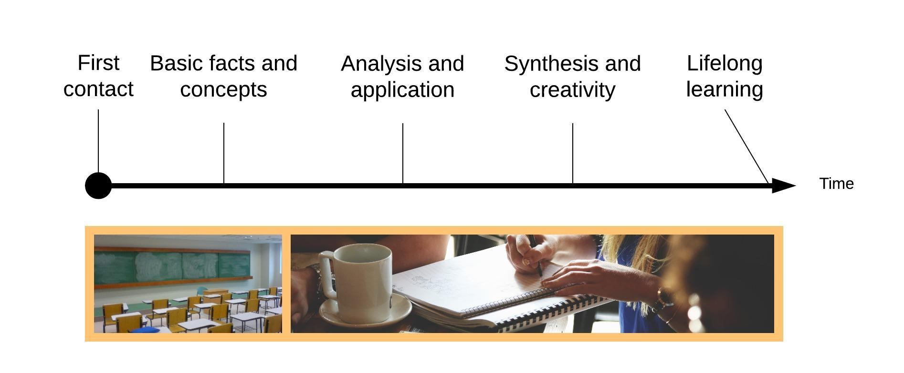
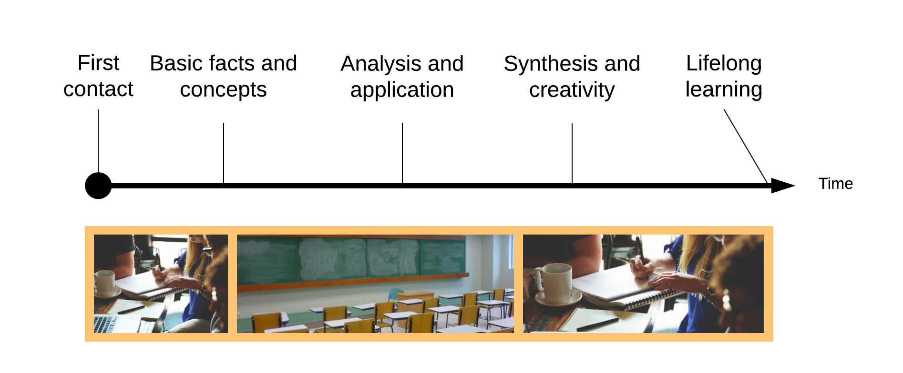
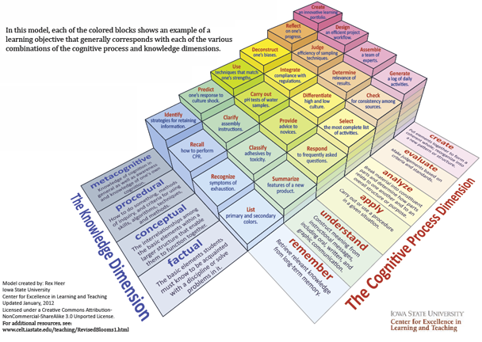

# Seven Steps to Flipped Learning Design: A Workbook

Version 4.0, August 2017

__Robert Talbert, Ph.D.__, Associate Professor of Mathematics, [Grand Valley State University](http://gvsu.edu), Allendale, Michigan USA

+ Web: [rtalbert.org](http://rtalbert.org)
+ Email: [talbertr@gvsu.edu](mailto:talbertr@gvsu.edu)
+ Twitter: [RobertTalbert](http://twitter.com/RobertTalbert)
+ Google+: [http://google.com/+RobertTalbert](http://google.com/+RobertTalbert)
+ GitHub: [http://github.com/RobertTalbert](http://github.com/RobertTalbert)

 This work is licensed under a <a rel="license" href="http://creativecommons.org/licenses/by-nc-nd/4.0/">Creative Commons Attribution-NonCommercial-NoDerivatives 4.0 International License</a>.

Image credit: [https://static.pexels.com/photos/55666/pexels-photo-55666.jpeg](https://static.pexels.com/photos/55666/pexels-photo-55666.jpeg)

## Introduction 

### What (and who) this workbook is for

This workbook is intended to provide a structured framework for designing a class using the principles of __flipped learning__. It is intended for any higher education faculty, regardless of your familiarity with the concept of flipped learning. In this workbook, you will learn a __systematic, structured framework for planning a single lesson in a flipped learning environment__. The idea is that if you can plan a single lesson in a single course using the principles of flipped learning, and if you can get comfortable with the nuts and bolts of a planning workflow, then you can work outward to "flip" an entire course if you choose and it won't be extraordinarily time-consuming or stressful. 

This workbook was originally written for a two-day minicourse on flipped learning design that I facilitated at the Mathematical Association of America MathFest conference in Washington, D.C. on August 6--8, 2015. It was inspired by Dee Fink's article/workbook _A self-directed guide to designing courses for significant learning_[^ref2] which I highly recommend as a companion piece. Dee Fink's booklet serves as a highly useful guide for "macro" design of courses at the large scale, whereas this workbook hopefully is useful for designing lessons at the "micro" scale and in an environment specifically oriented toward flipped learning.

My book _Flipped Learning: A Guide for Higher Education Faculty_ (Stylus 2017) contains a significantly expanded version of this workbook along with an extensive treatment of the history, theory, and practice of flipped learning in higher education. You can order it from [Stylus' website](https://sty.presswarehouse.com/Books/BookDetail.aspx?productID=468277) or on [Amazon](http://a.co/hrqEnMy).  

### How the workbook is structured and how to use it

<<<<<<< HEAD
After this introduction, there is a brief section that attempts to give a working definition of flipped learning and some of the key terms used in the workbook so that all users will be on the same page when designing course materials. Then, there are seven short sections, one for each of the seven steps of flipped learning design. Each section has four parts: 

1. _What we are going to do in this step:_ A short description of the outcome of the design step in question. 
2. _Why are we going to do it:_ Some rationale based on theory and practice as to why this step is what it is, and where it is. 
3. _Activities for you:_ Concrete workbook activities to complete that will lead you through the design in that step. 
4. Then there is a set of _frequently asked questions_ (FAQs) about the step. 
||||||| merged common ancestors
### How use this book
=======
### How to use this book
>>>>>>> origin/master

The recommended way to use this book is as follows:

+ First, choose a **course** that you teach, or will teach soon, to which you'd be interested in applying the principles of flipped learning. 
+ Then, select a **single lesson** from within that one course. By "lesson" we mean the block of content that you might set aside for a typical class meeting of 50 to 75 minutes. 
+ Then, **follow through the process** outlined in this booklet to design a flipped learning-oriented plan for that one lesson in that one course.

If you have the opportunity, you should then actually deploy that lesson to live students, collect data and responses, and see how it went. 

You might wish to read through the workbook once with the lesson in mind, then read it again and get your hands dirty with planning the second time. By doing the activities with an awareness of the overall picture and the background, you should end up with something that is close to a coherent, workable lesson that stays true to the pedagogical framework of flipped learning.

### If you have questions, corrections, suggestions, etc. 

Questions, corrections, suggestions, etc. are most welcome. The best way to report them is to contact me using one of the contacts at the front of the workbook. You can also go to the GitHub site for this workbook and submit a pull request: [https://github.com/RobertTalbert/sevensteps](https://github.com/RobertTalbert/sevensteps). 

## Background: What is flipped learning?

Throughout this workbook we will use the following definition of flipped learning:

>__Flipped Learning is a pedagogical approach in which first contact with new concepts moves from the group learning space to the individual learning space in the form of structured activity, and the resulting group space is transformed into a dynamic, interactive learning environment where the educator guides students as they apply concepts and engage creatively in the subject matter.__

This definition is a  variation on one given [by the Flipped Learning Network](http://flippedlearning.org/definition-of-flipped-learning/).

Let's unpack the terms in that definition: 

+ _Group learning space_ refers to any context in which students are assembling to learn as a group. For traditional face-to-face courses, this means "class time". For online courses, this could mean times when the class meets at the same time on Skype or a chat program to discuss things with the instructor, or a stretch of time where interaction takes place on a discussion board. 
+ _Individual learning space_ refers to any context in which students are learning outside of a formal group setting. For traditional face-to-face courses, this refers to time and space in between class meetings --- even if students work as a group (for example through an informal study group). For online classes, this refers to time and space spent by the student to work independently (again, whether or not s/he works with others). 

Flipped learning is called what it is because it "flips" the use of group and individual spaces from what is normally encountered in a traditional class setup. In the traditional model, learning begins in the group space through the introduction of new ideas (by the professor, through direct instruction) and some basic learning tasks, and mastery is expected to happen through later student work in their individual spaces: 

Whereas, in flipped learning, learning begins in the _individual_ space, with students working independently (but, crucially, with guidance in the form of structured activity), and mastery begins during the _group_ space with students working together on higher-level cognitive tasks. Students continue to practice and pursue mastery in their individual spaces using the group space experience as a launching pad. 

Note that very little about the _specifics_ of a flipped learning environment are given in this definition, and that's appropriate, since __flipped learning can look like many different things__ and different instructors implement flipped learning in many different ways in different disciplines, and between subjects within a discipline. Flipped learning is a _platform_ for teaching, not really a specific instructional technique like inquiry-based learning or POGIL or the Oxford tutorial method. There's room here for all shapes and sizes of teaching and learning preferences.

However, there are some things that flipped learning is _not_: 

+ **Flipped learning is not "videos before class, homework during class".** This is an oversimplification that is perpetuated by the popular media. Video is not necessary for flipped learning, and homework in class isn't either. In fact if the video is poor or the homework is not actively done, this is _not_ a flipped learning environment.
+ **Flipped learning is not "assign readings before class, discuss the readings in class".** Simply _assigning_ readings often fails because students do not know how to structure time or how to read a text analytically. Unstructured pre-class activities usually fail for all but the most expert learners. Flipped learning, by contrast, insists that _all_ learners in a class have meaningful, self-regulated learning experiences prior to class. It also insists that _all_ learners have rich, challenging learning experiences during class, and not leave discussion only to the most vocal.
+ **Flipped learning is not "videos before class, more lecture during class".** Using flipped learning simply to cover more material is abusing the model. Instead, we use the time liberated by moving direct instruction and other structured learning experiences out of the class to reinvest it in deep learning activities that involve students and activity.

## A quick overview of the seven steps

Designing a flipped learning experience for students isn't magic --- anyone can do it. But you have to have the proper mindset and a systematic approach. I propose that the following seven steps for that approach: 

1. __Come up with a brief but comprehensive list of learning objectives for your lesson.__
2. __Remix the learning objectives so that they appear in order of cognitive complexity.__
3. __Do a rough design of the in-class activity you intend students to do.__
4. __Go back to the learning objectives list, and split it into Basic objectives and Advanced objectives.__
5. __Finish the design of the in-class activity.__
6. __Design and construct the pre-class activity.__
7. __Design and construct any post-class activities you intended students to do.__

As mentioned earlier, the goal of this workbook is to help you get comfortable with this workflow so that the cognitive load and time requirement of planning a flipped learning lesson becomes minimal. 

Before we begin, you'll need to have the following ready:

+ __A class you intend to focus on, and one lesson within that class that you wish to design.__ This is ideally one 50- or 75-minute class meeting. If your "lesson" is spread over multiple days, focus for now on one of those days. If your class period spans a longer amount of time than this (e.g. three hours) then focus on one block of content that might occupy 50 to 75 minutes of that time.
+ __A computer or other device with internet access__ so you can write up what you are doing and search the web for resources.
+ __Any textbook or other resources that you will be using for your lesson__.

Your very first activity in this workbook is to write down the topic or name of the lesson you will focus on here. Do this in the space below: 

  
  
  
  
  

-----

## Step 1: Come up with learning objectives

### What we going to do in this step

In this step, we are going to __create a list of concrete, measurable learning objectives__ for the lesson that you have chosen. 

### Why are we going to do it

When designing either a course or a single lesson or even a single activity, we have to ask:

>What are students supposed to learn, and what (in my, the instructor's professional opinion) constitutes acceptable evidence that they have learned it?

The answers to these questions are what we call _learning objectives_. They vary in their specificity depending on the context; they tend to be broad and sweeping when designing a course (for example, "Exhibit the ability to apply basic material to applied problems you have not seen before") and more specific the more we "zoom in" on the course (for example, "Set up and solve an applied optimization problem", which is an instance of the larger course-level objective). In the context of this workbook, where we are zooming in on a single lesson, we want learning objectives that are:

+ __Unambiguous__. Each learning objective should be specific, easy to understand, and --- especially --- something the student can use later as a yardstick to measure their own understanding. 
+ __Concrete__. Objectives should only refer to actions we can actually measure, rather than internal states of mind or other non-measurable things. As a consequence, _words like "Know" or "Understand" or "Appreciate" should not be part of a lesson-level learning objective_. Obviously we want students to know, understand, and appreciate the main ideas of the lesson. But, how will you know if a student is doing so? The _actions_ they perform that tells you so are the real learning objectives. 
+ __Comprehensive__. Everything of importance in the lesson should be addressed by a combination of learning objectives (if not by its own learning objective).
+ __Minimal__. At the same time, we want to eliminate any redundancies in learning objectives so as to make the cognitive load on students as low as possible (but no lower!).

Once we ask and answer these questions, we are going to _share them with the students in the course_, in an up-front way that lets students know what it is they are supposed to be learning. By determining our learning objectives and sharing them with students, several good things happen: Students get a sense of the purpose of the lesson. Students also get a set of criteria that they can use to determine whether they really "know the material" or not, which is a crucial element of _self-regulated learning_. And we instructors get a set of criteria that we can use to assess student learning that is fair, objective, and standard for all students. 

To be sure, not all desirable outcomes of our courses can be encapsulated by learning objectives like these. For example, I want students in my mathematics courses to finish the course being fluent and comfortable with the concept of abstraction. That's a _course_-level objective. But on the micro scale, zooming into a single lesson, I have to think about specific tasks that students can perform, and which are measureable so that I can assess them, that move students incrementally toward that goal. That's what we're talking about in Step 1. 

**Example:** Suppose we're planning out a lesson in algebra focusing on the quadratic formula. By drawing upon my expertise as an instructor and maybe by scanning my textbook's section on this lesson, here is a possible list of learning objectives: 

+ Use the quadratic formula to find the roots of a second-degree polynomial.
+ Apply the quadratic formula to solve a real-world problem.
+ State the quadratic formula.
+ State the conditions under which a second-degree polynomial will have two real roots, one repeated root, or two complex roots.

Notice that each objective is unambiguous (the terms might be new but the task is straightforward) and concrete. 

### Activities for you

__Decide on a list of 3--8 learning objectives that meet the above criteria, and write them out.__ Remember to use action verbs; write clearly (because the student is the audience here); and make them comprehensive and yet minimal. You may need to make choices about what material to cover and what to leave out. Write those in a list in the space below. __Just list these in the order in which they appear, or the order in which they occurred to you.__ 

If you need more space, or have more than 8 objectives, just put them on a separate page.

1. Objective:   

2. Objective:   

3. Objective:   

4. Objective:   

5. Objective:   

6. Objective:   

7. Objective:   

8. Objective:   

### FAQ's about Step 1

__Q:__ _I can't seem to come up with decent learning objectives for my lesson. What should I do?_

__A:__ If you are using a textbook, start by skimming it and seeing what kinds of activities and exercises appear in the section you are teaching. Ask yourself: _What seem to be the most common tasks that these activities, examples, and exercises are expecting students to accomplish?_ This will give a good start on a list of learning objectives. You can also look around online for syllabi and materials from similar courses taught by others, and mine those resources for _their_ learning objectives. Finally, you can ask other people --- colleagues in your department, people in your personal learning network, etc. --- what _they_ think are the top 2--3 things students should learn in your lesson.

__Q:__ _What if I have more than 8 learning objectives for my lesson? Am I expecting too much from students?_

__A:__ It's quite possible that a complex lesson could have a fairly long list of learning objectives. However it's also possible that you are being overly ambitious. Take a good look at your list and ask yourself: _Are some of these objectives not strictly necessary for my lesson, and therefore I can remove them without harming the academic rigor of my class?_ Also: _Is it possible to combine some of these objectives into one larger objective of which the smaller ones are instances?_ Also: _Am I trying to do too much in one class meeting, and should I see if I can carve out more time in a second session to cover all these objectives?_

__Q:__ _And what if I only have one or two objectives? Is this not enough?_

__A:__ It's possible that your lesson involves just one or two concrete learning objectives. But it's not likely! It's probably that the learning objectives you have can, and possibly should, be split up into smaller ones that can and perhaps should be measured separately. 

---

## Step 2: Remix the learning objectives in order of complexity

### What we going to do in this step

In this step, we are going to __take the learning objective list from Step 1 and reorder it according to the cognitive complexity of the tasks from simplest to hardest__. 

### Why are we going to do it

Not all learning objectives in a lesson are created equal. Some are very simple: stating definitions of terms, recalling key dates and facts, identifying parts of the body or parts of a painting. Some are much more complex: analyzing a poem for structure, critiquing an argument, creating a model. __In flipped learning, we want students to engage with new concepts independently in their individual spaces but we do not expect students to master all the learning objectives on their own__. That is, we don't expect students to "teach themselves the material" --- not all of it, anyway. But we do insist that students learn the _basic_ material, the stuff that can certainly be acquired through guided, structured independent work. 

In order to do this, both we and our students have to have a sense of which objectives are simple and which ones aren't. That's probably easy for us, but not so easy for students, who typically have little to no experience in judging the complexity of a learning task from its description. 

A useful framework for thinking about complexity of learning tasks is __Bloom's Taxonomy__ ([^ref-bloom] and revised/updated in [^ref-bloomupdate]). Bloom's Taxonomy is often depicted as a pyramid:

Categories of cognitive tasks that are lower on the pyramid are considered to be less cognitively complex, and the complexity increases as we move up the pyramid. Note in this picture the _action verbs_ that are often associated with the various levels. Here is a 3D depiction of Bloom's Taxonomy made by Rex Heer at Iowa State University that splits student learning activities into two dimensions (Knowledge and Cognitive Processes) and then vertically by complexity level:

The 3D version is particularly helpful in university-level mathematics where a distinction between __procedural knowledge__ (recall of formulas and methods, and performance of mechanical computation) and __conceptual knowledge__ (deeper understanding of mathematical concepts, as measured in different ways such as applications and proof) becomes important. 

**Example:** Remember the learning objectives from the quadratic formula lesson: 

+ Use the quadratic formula to find the roots of a second-degree polynomial.
+ Apply the quadratic formula to solve a real-world problem.
+ State the quadratic formula.
+ State the conditions under which a second-degree polynomial will have two real roots, one repeated root, or two complex roots.

These were written down in no particular order other than the order in which I thought of them, and the last one might have been tacked on after skimming the textbook. The first objective is about applying the basic formula to do a rote, mechanical computation. So this is an _Apply_ task. The second objective is also an _Apply_ task, but since it involved application to a real world problem and not just a mathematical expression in isolation, it's a little more complex than the second objective. The third objective is pretty clearly a _Remember_ task. Finally the fourth objective seems to be the most complex one, asking learners to _Analyze_ a situation and draw general conclusions.

So, using a combination of our professional judgment and Bloom's Taxonomy, I would probably re-order the learning objectives as follows:

+ State the quadratic formula.
+ Use the quadratic formula to find the roots of a second-degree polynomial.
+ Apply the quadratic formula to solve a real-world problem.
+ State the conditions under which a second-degree polynomial will have two real roots, one repeated root, or two complex roots.

### Activities for you

Using one (or more) of the Bloom's Taxonomy visualizations, take the list of learning objectives that you wrote in Step 1 and reorder the items in the list in order from __least complex__ to __most complex__. It's OK if you feel like there is more than one way to do this; you are probably right. Some professional judgment will be necessary here.

1. Objective:   

2. Objective:   

3. Objective:   

4. Objective:   

5. Objective:   

6. Objective:   

7. Objective:   

8. Objective:   

### FAQ's about Step 2 

__Q:__ Does every lesson I plan need to have an instance from each of the six levels of the pyramid? For example, is it OK to have a lesson made entirely of "Knowledge" tasks?

__A:__ Not necessarily. For example, there are courses in the health sciences for pre-medical and pre-nursing students that are entirely focused on medical terminology. You might expect to see a lot of _Remember_ tasks in such a course and not too many _Evaluate_ tasks. Conversely some courses, for example capstone courses in a major or service-learning courses, may have very few low-level tasks and focus instead mostly on higher-level tasks. However: If you find yourself giving only low-level tasks, consider ways to introduce higher-level tasks in your course design.

---

## Step 3: Outline the group space activity 

### What we going to do in this step

In this step, we are going to __outline the main activity or activities that students will do in the group space__. 

### Why are we going to do it

Although conversations about flipped learning often focus on what students do before class and the videos they watch (more on that later), __the real purpose of flipped learning is on what students do during class__ (in their group space). We want to focus valuable class time --- when students and instructor are together and can help each other --- on tasks that are rigorous, creative, and challenging and therefore benefit the most from being together. 

_Those activities usually involve the items that are now in the bottom half of your remixed list of learning objectives_. These objectives are at the heart of a university-level "understanding" of the subject, and therefore they are of utmost importance and they need "all hands on deck" to attain them. That's why we are going to put the design of the in-class experience next, at the heart of the design process, and wait until later to think about what students do prior to this. 

So, in this step you need to think about activities that your students can do in class that address the hardest elements of your learning objective list. This may be just a single objective! But if that one objective is so problematic that your student need to spend 45-50 minutes of laser-like focus on it, then so be it. (College students rarely have a sense of how to focus on one thing for an extended period of time, so flipped learning design is helping them acquire and master this skill.)

**Example:** Back to the lesson on the quadratic formula, here was the ordered list of learning objectives: 

+ State the quadratic formula.
+ Use the quadratic formula to find the roots of a second-degree polynomial.
+ State the conditions under which a second-degree polynomial will have two real roots, one repeated root, or two complex roots.
+ Apply the quadratic formula to solve a real-world problem.

With those objectives in mind, here's what I would brainstorm as far as a plan for a 50-minute class session:

+ __First 10 minutes:__ Open Q&A on anything from the pre-class activity. (I haven't determined what that's going to cover yet; but I want to budget time for questions.)
+ __Next 25 minutes:__ An activity structured as follows. First, there's a warm-up question that asks them to write out the quadratic formula and then find the roots of two second-degree polynomials. Second, there's a question that involves some real-world situation in which we want to acquire some information that needs the quadratic formula. (A classic one is to give a projectile's equation of motion and determine the time at which the projectile will hit the ground.) Third, there's a question about determining when the roots of a polynomial are real or complex (to touch on the third objective).
+ __Last 10 minutes:__ Some time for debriefing and then a one-minute paper to wrap things up.

There are 5 minutes missing from this outline to give some built-in slack time for the actual class. Again: This is just an outline and there are pieces missing (especially, how I will assess whether students are learning during this activity). But, an activity with this outline would provide a solid 50 minutes of activity (not just "coverage") of the most complex learning tasks of the lesson. In a traditional setup, I might have 15-20 minutes for this. I will be "buying" that extra time by shifting the basic learning tasks to the individual space, which we'll talk about in a moment. 

### Activities for you

Answer each of the following:

+ What are the __main objectives to address from your list of learning objectives during in-class work?__ This should be a __relatively short list__ of tasks that students should perform that address the most complex items they need to learn, from which students will benefit by working together and with you present as the instructor to help on the spot.

      

+ Generally speaking (you'll flesh out the details later), what are you going to have students _do_ in class to show you how well they are mastering those learning objectives you just listed? (In other words, what's a rough outline of the tasks you are going to give to students?)

      

+ In your best professional judgment, about how long will this take? (_Recommendation_: __If your in-class activity is taking up more than 70% of your contact time (e.g. 35 out of 50 minutes), it needs to be shortened.__ Can some of it be done prior to class? Can some of it be moved to post-class? Can you give a simpler activity that still engages students at a high level?)

      

+ What _other_ activities do you want students to do in class? How long will they take? When are they going to happen during the meeting? (Also: Are all of these necessary or useful enough to justify spending class time on them?)

       

### FAQ's about Step 3

__Q:__ What if students show up to class unprepared for the group space activity that I am designing? 

__A:__ This is an important question. We'll get to that later. For now, assume that they will be prepared. 

__Q:__ _What are some ways I can free up even more time in my class for active learning?_

__A:__ Suggestions:

+ __Don't give course announcements in class.__ Make class announcements via email or your course's LMS instead. Or, put up a slide before class starts (and at the end) with all the announcements for the day and make the slide available online. This way students will have a record of the announcement, and no class time is taken up. Insist to students that it is their responsibility to handle information flow.
+ __Don't hand back papers in class.__ Try handing back papers prior to class time, or by appointment in office hours. I recently realized that if I spent 10 seconds per student in a class of 30 students handing back papers, that I've spent 5 minutes transferring pieces of paper. How many times have you wished you had 5 more minutes to finish an activity?
+ __Don't use paper at all.__ Have students type up their work, or write it up neatly and then scan it to a PDF, then have them submit work via Dropbox or your LMS or a single-purpose GMail account.

---

## Step 4: Split up the list of learning objectives

### What we going to do in this step

In this step, we will __return to our ordered list of learning objectives and split it into two lists: Basic Objectives and Advanced Objectives__. 

### Why are we going to do it

We now have a list of learning objectives that's ordered by cognitive complexity, and a sense of what is going to happen in class. Now we move _backwards_ and look again at the objectives. The list of learning objectives shows all the tasks that students should be able to do in order to provide evidence os mastery -- _eventually_. The _timing_ of student work on these matters, however. We don't need or expect students to show they've mastered _every_ learning objective _prior_ to coming to class; that's unrealistic, and if it were the case then there wouldn't be much of a need for a class.

So in this step we are going to do students a favor and specify __what they need to be able to do before arriving at class__, and __what they will focus on doing during and after class__. We do this by simply splitting the list of learning objectives in two -- drawing a line that separates the pre-class objectives from the in-class objectives. We'll call those objectives __Basic__ and __Advanced__ respectively.

Where this line is to be drawn is a function of your professional judgment. Look at your ordered list of learning objectives and ask two questions:

1. _What single item on my learning objectives list is the most advanced task I can reasonably expect a student to be fluent with, through independent study?_
2. _What single item on my learning objectives list is the least advanced task that I plan on having students address through their active work in class?_

By answering these questions, you'll discover a line of demarcation. On one side of the line are learning objectives that are simple enough that students can gain basic fluency on their own through structured activity. On the other side of the line are learning objectives that are advanced enough that students _might_ be able to pick up basic fluency on their own, but they will need to do active work with other students in class to really begin to "get it".

In this step, you find that line for your lesson and then draw it. This splits your list into two: __Basic objectives__ and __Advanced objectives__.

**Example:** Going back to the example from a hypothetical algebra class, we had this ordered list of objectives:

+ State the quadratic formula.
+ Use the quadratic formula to find the roots of a second-degree polynomial.
+ State the conditions under which a second-degree polynomial will have two real roots, one repeated root, or two complex roots.
+ Apply the quadratic formula to solve a real-world problem.

For me, my line of demarcation between Basic (students can learn these things in individual space with structured activities) and Advanced (students will work on these in group space) is between the second and third objectives: 

+ __Basic objectives:__
    * State the quadratic formula.
    * Use the quadratic formula to find the roots of a second-degree polynomial.
+ __Advanced objectives:__
    * State the conditions under which a second-degree polynomial will have two real roots, one repeated root, or two complex roots.
    * Apply the quadratic formula to solve a real-world problem.

Students are certainly able to see and memorize the quadratic formula on their own. And students can learn to do basic rote mechanical calculations for using the formula to find polynomial roots, through watching videos of worked-out examples or through simply reading those examples. Neither of these tasks _needs_ class time. The other two, however, are less certain. Skilled students might be able to learn to do these tasks on their own, but I'm not sure _every_ student could. So I don't expect students to do so. Rather, these two objectives will be the focus of the group space activities; and the two basic objectives are just enough to "launch" that group space activity, which remember we outlined in the previous step, and set students up for productive work on it. 

### Activities for you

Copy your ordered list of learning obejctives from Step 2 and draw a line that demarcates Basic Objectives from Advanced Objectives. __Ask yourself__: Why am I drawing the line here?

1. Objective:   

2. Objective:   

3. Objective:   

4. Objective:   

5. Objective:   

6. Objective:   

7. Objective:   

8. Objective:   

### FAQ's about Step 4

__Q:__ _What if I change my mind about where I want the line to go?_

__A:__ This is OK. Even in the example with my algebra class, where the line goes is dependent on the particular group of students I'm working with; the line for a class in one semester could be different for a class in another semester. Doing flipped learning does require careful sensitivity to the abilities and needs of individual students and this feeds into the design process. Fortunately, flipped learning also allows you to form personal relationships with each student and talk to each one every day, so this is easier than in a traditionally-structured course.

__Q:__ _What if my line is at the very top of the list --- that is,_ NONE _of my objectives are simple enough to leave to students prior to class?_

__A:__ Then you need to break down your learning objectives further and identify low-level tasks that you are taking for granted. For example in the algebra class, suppose I only wrote down the last two objectives (which I moved into the "Advanced" list). Thinking carefully about those objectives, I may realize that of course, students should be able to use the quadratic formula in a basic way first --- but that's such a low-level assumption that although it's necessary, it didn't occur to me. So I make this as a new objective and put it in the basic list. Same for stating the quadratic formula. Another possibility is that you may be underestimating your students' abilities to learn things on their own, or assuming they won't do the pre-class work. Try not to go down that road.

---

## Step 5: Finish making the group space activity

### What we going to do in this step

In this step, we will __finish the details of the group space activities we outlined in Step 3__. 

### Why are we going to do it

The "why" here is obviously because we haven't actually finished the group space activity yet. The goal here is to end this step with a finished product, ready to be deployed in class (or online if you are teaching an online or hybrid course). Whether that's a handout, a lab setup, discussion, etc. is up to you. 

### Activities for you

Write out answers to the following: 

+ Is the main activity aligned with the Advanced Learning Objectives?

    

+ Are there parts of the main in-class activity that seem too simple (i.e. would fit better in pre-class activities), too advanced (i.e. would be better done after class), or redundant in a non-productive way?

    

+ Are the activities in your main activity substantive, challenging, appropriately pitched to the audience?

    

+ How will you assess student progress as they learn during this activity? 

    

+ Do the other activities for your class session (entrance quizzes, exit tickets, etc.) make sense in the overall context of the class session? Do they take up too much time?

    

After answering the questions above, make out a rough timetable for what will happen and when during your class session below.

       

### FAQ's about Step 5

__Q:__ Does every Advanced objective need to be covered in my group space activity? 

__A:__ Not necessarily. Sometimes there are Advanced objectives that are _so_ Advanced that only a reasonable start on them can possibly be done in class. For example, an objective that requires creating something (a model, a project, a poster, a novella, etc.) requires more time and space than a typical class meeting allows. In that case, the objective is best suited for post-class activity (Step 7). But, you can often get students _started_ on those objectives through group space work. In fact most very-high-level objectives are rooted in lower-level (but also Advanced) objectives, which can be the focus of group space. 

---

## Step 6: Design the Guided Practice for pre-class work

### What we going to do in this step

In this step, we will __write up the activity that students will do in their individual space to prepare for the group space activity__. The model presented here is called _Guided Practice_. 

### Why are we going to do it

You have probably asked at some point in this process, _What if students don't come prepared for class?_ Let's counter that with another question: _Why wouldn't a student prepare for class?_ There are many answers to this question but they all hinge on a single idea: motivation. Simply put, if students _want_ to prepare for class, then barring circumstances out of their control, they'll do so. 

So, what makes students _want_ to complete an activity? It's usually a combination of the following:

+ __The activity is simple.__ The activity has an easily-understood structure and the student work required is straightforward and is perceived as "doable". 
+ __The activity is minimal.__ The activity does not ask students to do more than is necessary and keeps the extraneous cognitive load to a minimum. 
+ __The activity is engaging.__ The work students are asked to do should spark their interest and encourage them to complete it.
+ __The activity has clear value.__ The activity is not just busy work but is perceived as being essential for further understanding. 
+ __The activity is failure-tolerant.__ The activity should be relatively forgiving, even welcoming, of initial mistakes. Mistakes and errors should not be a source of stress. Rather, they should be collected and used as learning data.

One method for constructing individual space activities that I've used for several years is called _Guided Practice_. The name suggests that the activity is _practice_ on essential ideas, with _guidance_ in the form of structured exercises -- and that students are not being thrown into the deep end of the pool, left to their own devices to learn difficult material without help.

A Guided Practice activity consists of five parts: 

1. __Overview__. This is a short, one-paragraph overview of the material students are about to encounter, with an emphasis on how it connects to other things they have learned. 
2. __Learning objectives__. Here we simply reproduce the split list of learning objectives, clearly labeled "Basic" and "Advanced" so students will know, that we created in Step 4. This way, students will know exactly what is expected of them in the Guided Practice activity (by reading the Basic list) and in the lesson as a whole (by reading the Advanced list). 
3. __Resources for learning__. This consists of a recommended "playlist" of items that will help students engage with the basic learning objectives productively and set themselves up for success in the exercises that are coming up. Here we list any text, video, multimedia, or other resources that would be helpful for these tasks. 
4. __Exercises__. This section is the main area of activity for students. It consists of a small list of exercises that will instantiate the Basic learning objectives -- giving students the "practice" part of Guided Practice.
5. __Instructions for submitting work__. In the final section we give clear instructions on how to submit work. 

Below are links to some actual Guided Practice assignments I have given in two of my own courses. There are technical terms in these that you can simply ignore, and focus on the structure: 

+ [Additive and multiplicative counting principles](https://drive.google.com/open?id=0B3oyKFhpi58RMGZkRHVKRXJ5RGc)
+ [Propositional logic and truth tables](https://drive.google.com/open?id=0B3oyKFhpi58RazhXUDc4M2ZyN2M)
+ [Proof by mathematical induction](https://drive.google.com/open?id=0B3oyKFhpi58RQzBFUEJ0YmtPRkk)
+ [Spanning trees for weighted graphs](https://drive.google.com/open?id=0B3oyKFhpi58RWUpiRVNwZlpoMWc)

Notice that Guided Practice activities are very simple to make up if you have been following the steps in this workbook. In fact, you already have the Learning Objectives lists written out; and it should be straightforward to write an Overview for the lesson. The work yet to be done is to generate a list of learning resources, write the exercises, and decide how you want students to turn in their work. Some thoughts on these tasks: 

+ Ideally, learning resources should be a mix of media --- video _and_ text _and_ websites, etc. and students should be allowed to use whatever they want that will help them learn. There is no need to "make sure students have watched the videos". Just give resources, perhaps mark a few as ones that all students should use, and then let students choose. 
+ IMPORTANT: _Videos are not necessary for a successful flipped learning experience._ A common misconception is that video is an essential part of flipping, but this is neither historically the case nor is it true today. The first instances of flipped learning in the university were in the early 2000's, predating YouTube by at least five years, and videos were either not made at all or else only recommended and not required[^ref-videohistory].  [I've written more about this on my blog](http://rtalbert.org/flipped-learning-without-video/). 
+ In many ways the exercises are the most important part of the Guided Practice --- not the videos or other resources. Take care to write a small number of good ones that collect good learning data, rather than a large number that are redundant or poorly made. 
+ You don't need to "make sure students watch the videos" because the only thing that matters in the end is whether they have gained fluency with the Basic objectives and prepared for in-class work, and Guided Practice already has a means for determining this: The exercises. The means by which students learn how to work the exercises is secondary. 
+ Students should not have an undue work load placed on them before class. A good rule of thumb is that video content should be no longer than a typical in-class lecture would be. Another good rule of thumb is that students should spend 2--3 hours outside of class for every hour of in-class meetings; this rule can be used to judge whether the pre-class activities are too long. So, for example, a 50-minute class which normally would consist of a 45-minute lecture with 5 minutes of administrative or other tasks would be "flipped" into a Guided Practice that would take the average student about 100 minutes to complete, including no more than 45 minutes of video to watch. (Preferably far less than that.) 
+ Student work on pre-class assignments should be collected before class if possible so that the instructor knows what students know before the in-class activities begin. Electronic methods of submission are probably the best way to do this. For example, my Guided Practice examples use Google Forms. 

Finally, a word about grading Guided Practice. I recommend that __Guided Practice assignments should be graded on a Pass/Fail rubric, on the basis of completeness, effort, and timeliness only.__ In my examples above, Guided Practice is graded "Satisfactory" or "Unsatisfactory", with "Satisfactory" given if if the work is turned in on time (11:59pm of the evening before the class meeting) and each exercise on the assignment shows evidence of a good-faith effort to be right. "Unsatisfactory" is given if the work is late, if there is a question left blank, or if a response is an obvious random guess. This makes the assignment more failure-tolerant because students just have to _complete_ the assignment to get full credit, and it's a lot easier to grade.

### Activities for you

Do all these in a seperate document that you will eventually give to students as an assignment. 

1. Write out an overview for your lesson; or give a mind map or similar means of introducing the new material and connecting it to previously-learned materials.
2. Copy the split lists of learning objects you made in Step 4.
3. Gather any text, video, or other resources for learning that you can find or make and include this as a list in your document. Remember not to make this too long; and encourage students to add resources that they find and exercise choice in what resources they use.
4. Write up a short list of exercises -- "low hanging fruit" that students can do that will lead them through successful engagement with the Basic learning objectives.
5. Determine how students will submit their work, and give clear instructions on how to do this. If you have time, actually make up the form for submitting work and include a link to it.

### FAQ's about Step 6

__Q:__ OK, can we now talk about what happens if students don't do their pre-class work? 

__A:__ Sure, but there are really two questions here: (1) What do I do if students don't do their pre-class work? And (2) How do I prevent this from happening? 

Let's address the second question first, because obviously we don't _want_ students to come unprepared, and focusing on prevention and helping students to learn is a more positive and proactive stance to take. It comes back to what we mentioned earlier about _motivation_. If students _want_ to complete the Guided Practice, generally speaking they will. So our goal is to create an assignment they want to finish. 

The _structure_ of the individual space activity is the key to this motivation. If the activity is minimal, simple, engaging, valuable, and failure-tolerant then students are more likely to complete it than otherwise. The Guided Practice model is built with this in mind. The overview and split list of Learning Objectives provides simplicity and clarity. The list of resources provides handholds for students to use, so it's engaging and doable. The exercises (if well made) are valuable, engaging, and simple. And the grading process I mentioned --- Pass/Fail on the basis of completeness and effort --- makes it failure-tolerant. 

Since I started structuring pre-class assignments in this way, I have typically seen 85% to 95% of my students earn a Pass grade on every Guided Practice assignment. Getting students to do the pre-class work simply has not been a problem. This doesn't mean that every students masters the Basic learning objectives or is totally prepared for in-class work. But the students who complete the work, which again is consistently almost all of them, know enough to be able to at least work productively with others who may understand more. I truly believe that, even if you do not adopt the Guided Practice template, if you structure the pre-class activity well and make it something students _want_ to complete, they will, for the most part. 

But suppose they don't. How do you handle situations where students come unprepared? You have to gauge two things: the _extent_ of the problem (how many students are unprepared?) and the _degree_ (how bad is the underpreparation?). In the full-length book form of this workbook I go into extensive detail on this (based on personal experiences). Here, I'll just focus on the "doomsday scenario" --- a large number of students come to class with major preparation issues. 

First please realize this rarely happens, except at the beginning of the semester when students are still exploring the boundaries of the class and the flipped learning setup --- for example, the first time students have a class meeting that well and truly requires preparation through Guided Practice. If you have a large number of students who don't complete the work, I recommend these steps: 

1. Put away the group space activity you had planned, and spend the class fielding specific questions from students about the material that they struggled with. Do this in a way that places the responsibility for asking questions on the students. For example, get students into groups of 3--4 and have them generate specific questions that are then put on the board or projector, and then prioritized. __Do not accept requests that are not questions about specific items.__ For example "I didn't understand anything" is not a question and therefore not fair game from this impromptu Q&A session; neither is "Could you re-teach section 3?" __Only specific, targeted questions are allowed and only those that are brought up by students.__
2. Then take your time to answer those questions in a succint, clear way. 
3. Before ending the class __make sure students are clear on the expectations being held for them in the class, and if this situation happens again they will have to face consequences that could impact their grade in the course.__ Set the boundaries in no uncertain terms. Ask students if they have questions about the boundaries; you might even have them sign a statement that affirms that they know what the boundaries are and agree to abide by them in the future. 
4. Then, make sure to end the class as planned, by taking the last few minutes of class to have students engage in a metacognitive or self-regulation activity. A particular set of self-regulated learning questions you should ask is: 

>Do you feel like you were unprepared for class? If so, why? Did you seek help from anyone before class to get help? If so, what did you do, and why wasn't it helpful for you? If not, why not? What are your plans for preparing for the next class to ensure that you arrive sufficiently prepared to work? 

As for the group space activity, you can adjust the calendar to do it later, assign it as homework, or something else. 

__But under no circumstances should you re-teach the material in class in this case.__ The first time a widespread pattern of serious underpreparation happens, the above steps turn the group space into something that addresses student questions (which is different than simply re-teaching) and reaffirms the division of labor in the flipped learning model, and the air should be clear regarding how flipped learning works. The _second_ time this happens, it's because students are willfully not abiding by the social contract of the class, and there have to be consequences. What you _do_ in this scenario is up to you, but failing to do anything sends the message to students that the flipped learning model is just an illusion, and if enough students underprepare enough, they'll get the traditional model. Setting clear boundaries, with consequences for persistent violation, is crucial for a successful flipped learning environment. 

But again --- the main thing is to write activities that students want to do in the first place, to prevent this from happening. 

---

## Step 7: Write up post-class activities

### What we going to do in this step

In this step, we will __design any activities that are intended to take place after the group space activity from Steps 3 and 5 is over__. 

### Why are we going to do it

The work of learning the material in your lesson isn't done just because class time is over. There could be learning objectives that take significant time and space to master, more time and space than are available in a class meeting. It's completely within the definition of flipped learning to have students doing extended work, to reach the uppermost levels of Bloom's Taxonomy, through post-class work -- through any of a number of methods:

+ Students might be tasked with completing a formal write-up of their in-class work to submit later as homework.
+ Students might be given a post-class project that expands further upon the objectives done in class.
+ Students might be given a lab or service-learning assignment that applies the advanced objectives to something even higher up Bloom's Taxonomy.
+ Alternatively, students might be given more practice work that focuses on drill and mastery of the lower-level tasks on Bloom's Taxonomy.

The possibilities are extensive here.

### Activities for you

+ What advanced learning objectives from your list will need further attention after the in-class activity has been completed?

    

+ What other learning objectives (Basic or Advanced) would benefit from further practice?

    

+ What activities outside of class would provide continued engagement with the Advanced learning objectives?

    

+ What activities outside of class would provide further depth and breadth with Basic learning objectives?

    

+ Now make a list of activities to assign for post-class work. Estimate the time required for the average student to complete these activities.

    
    

+ Write up the assignments you intend to give for post-class activity.

+ Looking at the time estimates for the post-class activities and the time estimates for the pre-class activities, determine whether your total time requirements for out-of-class work average out to 2-3 times the amount of time spent in class. If it's more, then think of ways to trim back the size or extent of some of your activities.

    

### FAQ's about Step 7

__Q:__ _So, Step 7 seems no different than a traditionally structured course._

__A:__ In some ways that's right. Every course regardless of structure has these extended activities that take time and space not available to us in class. The big difference here in flipped learning is that we have devoted significant class time to drilling deeply into the Advanced learning objectives, so every student has a reference point for those objectives as they move forward. For example, suppose students in our hypothetical algebra class from earlier were given a post-class assignment to go out and collect some data that have a roughly parabolic shape to them, find a formula that fits the data, and then use the quadratic formula to say something interesting about it. (Fitting a model to data would probably be an additional learning objective, or maybe this was an Advanced objective from an earlier lesson.) If a student had trouble with the math, we could say: "Remember the activity we did in class that was similar to this? How did this work, then?"

__Q:__ _Is it possible that I could_ NOT _focus class time on the most advanced objectives, and instead use a post-class activity for these and spend class time hitting sort of the "middle" of my objectives list?_

__A:__ Using class time to cover most, but not all of the advanced objectives and then saving the "most advanced" objectives for outside-class work _could_ work well for students. But, remember the point of flipped learning is to work on those most difficult tasks _while there is support readily available_. How the objectives are addressed is up to you, but do keep in mind that we want to put students in a position where they are not encountering _new_ and _advanced_ objectives when they are apart from a corresponding level of help and connection.

---

## Conclusion

This workbook is just a template for one way of designing courses for flipped learning experiences. Your mileage ay vary! What's important is that the __students are the ones who are constructing the meaning and understanding of the material, through intentional design and productive independent learning experiences that are integral to the course__. And in flipped learning, this happens __by students getting productive independent learning experiences prior to class, then engaging with difficult ideas in a safe, dynamic, and creative classroom environment focused on their needs.__

How you make this happen is up to you and is largely a matter of experience, professional judgment, and personal taste.

The research on flipped learning is showing that flipped learning environments are good for students in almost every way. Students get greater ownership over their learning and practice with lifelong learning skills. Student attainment on course content objectives, across different disciplines, is never worse than in a traditional setting and is in most cases better. Flipped environments make it easy to use the kinds of active learning techniques that are proven, through decades of research, to benefit student learning more than traditional lecture environments. All signs are pointing to flipped learning as an emerging normative practice in K-12 and higher education. We owe it to ourselves professionally, and to our students, to embrace flipped learning and build it into our teaching.

## Postscript: Some questions we did not answer in this workbook

There are many things not addressed in this workbook, but which you should think about and plan for. Some of those are addressed by the questions below.

+ How are you going to deploy your materials? Through a LMS, a website, paper handouts, etc.?
+ How will you handle issues involving access to technology? (For example, will you require all students to have 24/7 access to a high speed internet connection -- and what if a student doesn't have that?)
+ What plan do you have in place if a student complains of having to "teach themselves the material"?
+ What plan do you have in place if a student complains that you "aren't teaching"? (Or, that the student is "paying tuition to have a teacher" and you are not delivering?)
+ Are you going to contact your department head and/or academic dean prior to running a flipped learning designed class?
+ Are you going to "flip" an entire class, or just part of one? If just a part, which parts -- and why not the others? Also, if you are only partially flipping, then how will you help students to adapt to the two different teaching modalities in your course?
+ Are you going to make your own content for the course? If so, will you be doing your own video, your own text, or both of these? What tools will you use? What is your plan for completing the content in a timely way?
+ If you are _not_ creating your own content, where will you look for curated content, and what will be the basis on which you decide to give a resource to students?
+ What plan do you have in place for making your flipped learning materials usable in the long term, so you don't have to rewrite them all the next time you teach the course?
+ What plan do you have for sharing your work with others, either in your department or online?
+ Are you connected in with a network of colleagues, either in person or online or both, who are also flipping the same class or the same subject? If not, have you considered using Twitter or Google+ to make those connections?

[^ref1]: Primary and secondary educators might also find this useful, but I am aiming at college and university instructors specifically. The differences in contexts and assumptions for learners in higher education versus those in K-12 education are so great that a resource for one doesn't always serve the other.
[^ref2]: Fink, L. D. (2003). A self-directed guide to designing courses for significant learning. University of Oklahoma, 35. Retrieved from http://www.bu.edu/sph/files/2011/06/selfdirected1.pdf
[^ref3]: http://www.flippedlearning.org/definition
[^ref4]: This is one reason why I prefer the term "flipped learning" over the far more popular "flipped classroom". For more, see: [http://rtalbert.org/blog/2016/what-do-we-call-this-thing](http://rtalbert.org/blog/2016/what-do-we-call-this-thing)
[^ref-bloom]: Bloom, B. S. (1956). Taxonomy of Educational Objectives. Educational and Psychological Measurement, 16, 401–405. http://doi.org/10.1177/001316445601600310
[^ref-bloomupdate]: Sosniak, Lauren A. Bloom's Taxonomy. Ed. Lorin W. Anderson. Univ. Chicago Press, 1994.
APA
[^ref-iastate]: http://www.celt.iastate.edu/teaching-resources/effective-practice/revised-blooms-taxonomy/
[^ref-bloomwheel]: https://www.flickr.com/photos/dougbelshaw/4100721032
[^ref-omp]: http://writing.berkeley.edu/wab/2-2-gone.htm
[^ref-exit]: http://www.theteachertoolkit.com/index.php/tool/exit-ticket
[^ref-mindmap]: http://www.mindmapping.com/
[^ref-videohistory]: More on this in my  book _Flipped Learning: A Guide for Higher Education Faculty_ (Stylus Publishing 2017).
[^ref-srl]: https://teal.ed.gov/tealguide/selfregulated
[^ref-lorena]: http://openedx.seas.gwu.edu/courses/GW/MAE6286/2014_fall/about
[^ref-gforms]: https://www.google.com/forms/about/
[^ref-lc]: https://www.pearsonhighered.com/products-and-services/course-content-and-digital-resources/learning-applications/learning-catalytics.html
[^ref-pe]: https://www.polleverywhere.com/
